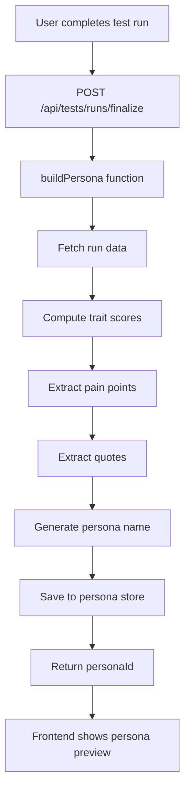
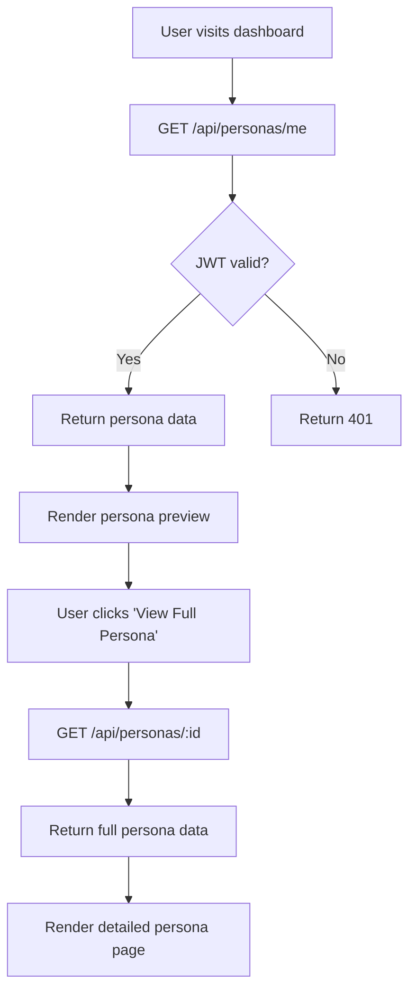

# 🎓 Learning Guide: Full-Stack Persona Generation System

This guide explains how to build a complete full-stack application that generates data-driven personas from user testing sessions. You'll learn the architecture, implementation patterns, and how all the pieces work together.

## 📋 Table of Contents

1. [System Overview](#system-overview)
2. [Backend Architecture](#backend-architecture)
3. [Frontend Architecture](#frontend-architecture)
4. [Data Flow](#data-flow)
5. [Key Implementation Patterns](#key-implementation-patterns)
6. [Testing & Deployment](#testing--deployment)

---

## 🏗️ System Overview

### What We Built
A full-stack application that:
- Collects user testing data (events, transcript, survey responses)
- Analyzes behavioral patterns using an insights engine
- Generates rich, data-driven personas automatically
- Displays personas with beautiful, interactive UI

### Tech Stack
- **Backend**: Node.js + Express + TypeScript
- **Frontend**: React + TypeScript + Tailwind CSS
- **Data Storage**: In-memory (for MVP, easily replaceable with database)
- **Authentication**: JWT tokens

---

## 🔧 Backend Architecture

### 1. Data Models

#### Persona Model (`backend/src/models/Persona.ts`)

```typescript
export interface Persona {
  id: string;
  userId: string;
  runId: string;
  name: string;
  traitScores: Record<string, number>;  // JSON object
  painPoints: string[];                 // JSON array
  quotes: string[];                     // JSON array
  createdAt: Date;
  updatedAt: Date;
}

// In-memory storage pattern
class PersonaStore {
  private personas: Persona[] = [];
  private nextId = 1;

  create(data: Omit<Persona, 'id' | 'createdAt' | 'updatedAt'>): Persona {
    const persona: Persona = {
      id: this.nextId.toString(),
      ...data,
      createdAt: new Date(),
      updatedAt: new Date()
    };
    this.personas.push(persona);
    this.nextId++;
    return persona;
  }

  getLatestByUserId(userId: string): Persona | undefined {
    return this.personas
      .filter(persona => persona.userId === userId)
      .sort((a, b) => new Date(b.createdAt).getTime() - new Date(a.createdAt).getTime())[0];
  }
}

export const personaStore = new PersonaStore();
```

**Key Learning Points:**
- Use TypeScript interfaces for type safety
- Implement singleton pattern for data stores
- Separate data models from business logic
- Use generic types like `Omit<T, K>` for flexible constructors

### 2. Business Logic Service

#### Persona Service (`backend/src/services/personaService.ts`)

```typescript
export async function buildPersona(runId: string): Promise<PersonaData> {
  // 1. Fetch test run data
  const testRun = testRuns.get(runId);
  const { events = [], transcript = '', surveyResponses = [], userId } = testRun;

  // 2. Compute trait scores from insights engine
  const traitScores = computeTraitScores(events, transcript, surveyResponses);

  // 3. Extract pain points from transcript
  const painPoints = extractPainPoints(transcript);

  // 4. Extract quotes from transcript
  const quotes = extractQuotes(transcript);

  // 5. Generate persona name based on dominant traits
  const name = generatePersonaName(traitScores);

  // 6. Create and return persona
  const persona = personaStore.create({
    userId, runId, name, traitScores, painPoints, quotes
  });

  return { personaId: persona.id, persona };
}

function computeTraitScores(events: any[], transcript: string, surveyResponses: any[]): Record<string, number> {
  const scores: Record<string, number> = {
    'Analytical': 0, 'Creative': 0, 'Social': 0, 'Practical': 0,
    'Confident': 0, 'Cautious': 0, 'Efficient': 0, 'Thorough': 0
  };

  // Analyze event patterns
  const eventTypes = events.map(e => e.type);
  const eventCounts = eventTypes.reduce((acc, type) => {
    acc[type] = (acc[type] || 0) + 1;
    return acc;
  }, {} as Record<string, number>);

  // Score based on behavioral patterns
  if (eventCounts['click'] > 10) scores['Practical'] += 0.3;
  if (eventCounts['hover'] > 5) scores['Cautious'] += 0.2;
  if (eventCounts['scroll'] > 3) scores['Thorough'] += 0.2;

  // Analyze transcript for personality indicators
  const transcriptLower = transcript.toLowerCase();
  if (transcriptLower.includes('think') || transcriptLower.includes('analyze')) {
    scores['Analytical'] += 0.4;
  }

  // Normalize scores to 0-1 range
  Object.keys(scores).forEach(key => {
    scores[key] = Math.min(Math.max(scores[key], 0), 1);
  });

  return scores;
}
```

**Key Learning Points:**
- Separate concerns: data fetching, analysis, and storage
- Use async/await for operations that might be async
- Implement scoring algorithms based on behavioral patterns
- Normalize data to consistent ranges (0-1)

### 3. API Routes

#### Persona Routes (`backend/src/routes/personas.ts`)

```typescript
export const getMyPersona = (req: Request, res: Response) => {
  try {
    const userId = req.user!.userId;  // From JWT middleware
    
    const persona = personaStore.getLatestByUserId(userId);
    
    if (!persona) {
      return res.status(404).json({
        success: false,
        error: 'Not found',
        message: 'No persona found for this user'
      });
    }

    res.json({
      success: true,
      data: {
        personaId: persona.id,
        name: persona.name,
        traitScores: persona.traitScores,
        painPoints: persona.painPoints,
        quotes: persona.quotes,
        createdAt: persona.createdAt
      }
    });

  } catch (error) {
    console.error('Error fetching user persona:', error);
    res.status(500).json({
      success: false,
      error: 'Internal server error',
      message: 'Failed to fetch persona'
    });
  }
};
```

**Key Learning Points:**
- Use Express middleware for authentication (`req.user`)
- Consistent error handling pattern
- Return structured JSON responses
- Use TypeScript for type safety

### 4. Route Registration

#### Main Server (`backend/src/index.ts`)

```typescript
import { 
  getMyPersona, 
  getPersonaById, 
  getUserPersonas 
} from './routes/personas';
import { verifyToken as authMiddleware } from './middleware/auth';

// Persona endpoints with authentication
app.get('/api/personas/me', authMiddleware, getMyPersona);
app.get('/api/personas/:id', authMiddleware, getPersonaById);
app.get('/api/personas', authMiddleware, getUserPersonas);
```

**Key Learning Points:**
- Use middleware for authentication on protected routes
- Organize routes by feature (personas, tests, auth)
- Import specific functions rather than entire modules

---

## 🎨 Frontend Architecture

### 1. Component Structure

#### Persona Page Component (`frontend/src/pages/PersonaPage.tsx`)

```typescript
const PersonaPage: React.FC = () => {
  const { id } = useParams<{ id: string }>();  // React Router
  const navigate = useNavigate();
  const [persona, setPersona] = useState<Persona | null>(null);
  const [loading, setLoading] = useState(true);
  const [error, setError] = useState<string | null>(null);

  useEffect(() => {
    const fetchPersona = async () => {
      try {
        const token = localStorage.getItem('authToken');
        const response = await fetch(`http://localhost:3001/api/personas/${id}`, {
          headers: { 'Authorization': `Bearer ${token}` }
        });

        if (!response.ok) {
          throw new Error('Failed to fetch persona');
        }

        const data = await response.json();
        setPersona(data.data);
      } catch (err) {
        setError('Failed to load persona data');
      } finally {
        setLoading(false);
      }
    };

    if (id) {
      fetchPersona();
    }
  }, [id]);

  // Render loading state
  if (loading) {
    return <div className="animate-spin">Loading...</div>;
  }

  // Render error state
  if (error || !persona) {
    return <div>Error: {error}</div>;
  }

  return (
    <div className="min-h-screen bg-gray-50 p-6">
      {/* Persona content */}
    </div>
  );
};
```

**Key Learning Points:**
- Use React hooks for state management (`useState`, `useEffect`)
- Handle loading, error, and success states
- Use TypeScript for component props and state
- Implement proper error boundaries

### 2. API Service Layer

#### API Service (`frontend/src/services/api.ts`)

```typescript
// Generic API request function
async function apiRequest<T>(
  endpoint: string, 
  options: RequestInit = {}
): Promise<ApiResponse<T>> {
  try {
    const url = `${API_BASE_URL}${endpoint}`;
    const response = await fetch(url, {
      headers: {
        'Content-Type': 'application/json',
        ...options.headers,
      },
      ...options,
    });

    if (!response.ok) {
      const errorData = await response.json().catch(() => ({}));
      throw new Error(errorData.message || `HTTP error! status: ${response.status}`);
    }

    return await response.json();
  } catch (error) {
    console.error('API request failed:', error);
    throw error;
  }
}

// Specific API functions
export async function getMyPersona(): Promise<{
  personaId: string;
  name: string;
  traitScores: Record<string, number>;
  painPoints: string[];
  quotes: string[];
  createdAt: string;
}> {
  const response = await apiRequest<{
    personaId: string;
    name: string;
    traitScores: Record<string, number>;
    painPoints: string[];
    quotes: string[];
    createdAt: string;
  }>('/api/personas/me');
  return response.data;
}
```

**Key Learning Points:**
- Create reusable API request function
- Use TypeScript generics for type safety
- Centralize error handling
- Separate API logic from components

### 3. UI Components

#### Dashboard with Persona Preview (`frontend/src/pages/Dashboard.tsx`)

```typescript
const Dashboard: React.FC = () => {
  const [persona, setPersona] = useState<Persona | null>(null);
  const [loading, setLoading] = useState(true);

  useEffect(() => {
    const loadUserAndData = async () => {
      try {
        const token = localStorage.getItem('authToken');
        const personaResponse = await fetch('http://localhost:3001/api/personas/me', {
          headers: { 'Authorization': `Bearer ${token}` }
        });

        if (personaResponse.ok) {
          const personaData = await personaResponse.json();
          setPersona(personaData.data);
        } else if (personaResponse.status === 404) {
          setPersona(null); // No persona exists
        }
      } catch (err) {
        setError('Failed to load dashboard data');
      } finally {
        setLoading(false);
      }
    };

    loadUserAndData();
  }, []);

  return (
    <div className="min-h-screen bg-gray-50 p-6">
      {persona ? (
        <div className="bg-gradient-to-r from-blue-50 to-purple-50 p-6 rounded-lg">
          <h3 className="text-xl font-semibold">{persona.name}</h3>
          
          {/* Trait Summary */}
          <div className="flex flex-wrap gap-2">
            {Object.entries(persona.traitScores)
              .sort(([,a], [,b]) => b - a)
              .slice(0, 3)
              .map(([trait, score]) => (
                <span key={trait} className="px-2 py-1 bg-blue-100 text-blue-800 text-xs rounded-full">
                  {trait} ({Math.round(score * 100)}%)
                </span>
              ))}
          </div>

          <Button onClick={() => navigate(`/persona/${persona.personaId}`)}>
            View Full Persona
          </Button>
        </div>
      ) : (
        <Button onClick={() => navigate('/run-suite/fullPersonaRun')}>
          Create Persona
        </Button>
      )}
    </div>
  );
};
```

**Key Learning Points:**
- Use conditional rendering for different states
- Implement responsive design with Tailwind CSS
- Create reusable UI components
- Use React Router for navigation

---

## 🔄 Data Flow

### 1. Persona Generation Flow



### 2. Persona Display Flow



---

## 🛠️ Key Implementation Patterns

### 1. Authentication Pattern

```typescript
// Middleware for JWT verification
export const verifyToken = (req: Request, res: Response, next: NextFunction) => {
  const authHeader = req.headers.authorization;
  
  if (!authHeader || !authHeader.startsWith('Bearer ')) {
    return res.status(401).json({ 
      success: false, 
      message: 'No token provided' 
    });
  }

  const token = authHeader.substring(7);
  
  try {
    const decoded = jwt.verify(token, JWT_SECRET) as any;
    req.user = { userId: decoded.userId, email: decoded.email };
    next();
  } catch (jwtError) {
    return res.status(401).json({ 
      success: false, 
      message: 'Invalid token' 
    });
  }
};
```

### 2. Error Handling Pattern

```typescript
// Consistent error response structure
interface ApiResponse<T> {
  success: boolean;
  data?: T;
  error?: string;
  message?: string;
}

// Usage in routes
try {
  // Business logic
  res.json({ success: true, data: result });
} catch (error) {
  console.error('Error:', error);
  res.status(500).json({
    success: false,
    error: 'Internal server error',
    message: 'Failed to process request'
  });
}
```

### 3. State Management Pattern

```typescript
// React component state pattern
const [data, setData] = useState<DataType | null>(null);
const [loading, setLoading] = useState(true);
const [error, setError] = useState<string | null>(null);

useEffect(() => {
  const fetchData = async () => {
    try {
      setLoading(true);
      setError(null);
      const result = await apiCall();
      setData(result);
    } catch (err) {
      setError(err.message);
    } finally {
      setLoading(false);
    }
  };

  fetchData();
}, [dependencies]);
```

### 4. API Service Pattern

```typescript
// Generic API service with TypeScript
class ApiService {
  private baseUrl: string;
  private token: string | null;

  constructor(baseUrl: string) {
    this.baseUrl = baseUrl;
    this.token = localStorage.getItem('authToken');
  }

  private async request<T>(
    endpoint: string, 
    options: RequestInit = {}
  ): Promise<T> {
    const url = `${this.baseUrl}${endpoint}`;
    const headers = {
      'Content-Type': 'application/json',
      ...(this.token && { 'Authorization': `Bearer ${this.token}` }),
      ...options.headers,
    };

    const response = await fetch(url, { ...options, headers });
    
    if (!response.ok) {
      throw new Error(`HTTP ${response.status}: ${response.statusText}`);
    }

    return response.json();
  }

  async getPersona(id: string): Promise<Persona> {
    return this.request<Persona>(`/api/personas/${id}`);
  }
}
```

---

## 🧪 Testing & Deployment

### 1. Backend Testing

```typescript
// Example test for persona service
describe('PersonaService', () => {
  it('should build persona from test run data', async () => {
    const mockRunData = {
      events: [{ type: 'click', timestamp: Date.now() }],
      transcript: 'I think this interface is confusing',
      surveyResponses: [{ question: 'confidence', answer: 'high' }],
      userId: 'user123'
    };

    const persona = await buildPersona('run123');
    
    expect(persona.persona.name).toBeDefined();
    expect(persona.persona.traitScores.Analytical).toBeGreaterThan(0);
    expect(persona.persona.painPoints.length).toBeGreaterThan(0);
  });
});
```

### 2. Frontend Testing

```typescript
// Example test for persona page
import { render, screen, waitFor } from '@testing-library/react';
import PersonaPage from './PersonaPage';

describe('PersonaPage', () => {
  it('should display persona data when loaded', async () => {
    render(<PersonaPage />);
    
    await waitFor(() => {
      expect(screen.getByText('Alex the Analytical')).toBeInTheDocument();
      expect(screen.getByText('Analytical (85%)')).toBeInTheDocument();
    });
  });
});
```

### 3. Deployment Checklist

```bash
# Backend deployment
npm run build          # Compile TypeScript
npm test              # Run tests
npm start             # Start production server

# Frontend deployment
npm run build         # Create production build
npm test              # Run tests
serve -s build        # Serve static files
```

---

## 🎯 Key Takeaways

### Architecture Principles
1. **Separation of Concerns**: Backend handles data, frontend handles UI
2. **Type Safety**: Use TypeScript throughout the stack
3. **Error Handling**: Consistent error patterns across the application
4. **Authentication**: JWT-based auth with middleware
5. **State Management**: React hooks for local state

### Development Patterns
1. **Service Layer**: Business logic in services, not routes
2. **Component Composition**: Reusable UI components
3. **API Abstraction**: Centralized API calls with error handling
4. **Loading States**: Always show loading/error states
5. **TypeScript**: Leverage types for better development experience

### Scalability Considerations
1. **Database**: Replace in-memory storage with PostgreSQL/MongoDB
2. **Caching**: Add Redis for session management
3. **Microservices**: Split into separate services as needed
4. **Monitoring**: Add logging and metrics
5. **Testing**: Comprehensive test coverage

---

## 🚀 Next Steps

1. **Add Database**: Replace in-memory storage with real database
2. **Enhance Analytics**: Add more sophisticated persona generation algorithms
3. **Real-time Updates**: Add WebSocket support for live updates
4. **Export Features**: Allow users to export personas as PDF/JSON
5. **Advanced UI**: Add charts, graphs, and interactive visualizations

This system demonstrates modern full-stack development patterns with TypeScript, React, and Node.js. The architecture is scalable, maintainable, and follows best practices for production applications. 